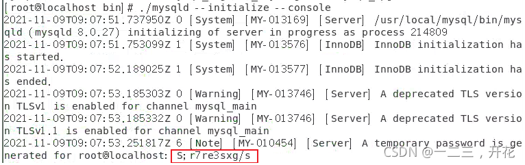
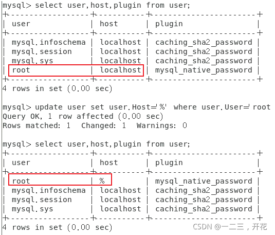
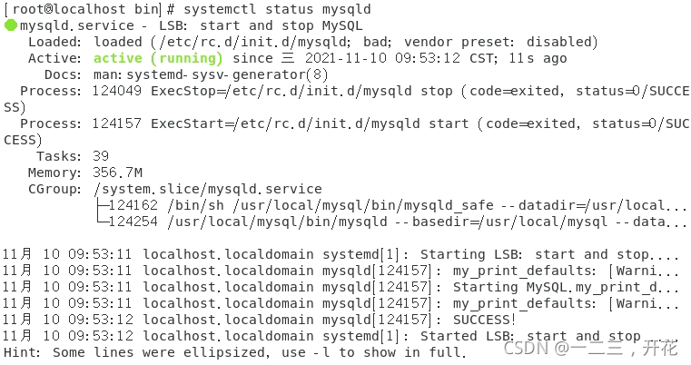

## 编译安装MySQL8


### 1. 卸载本机以存在的数据库

```bash
rpm -qa|grep mariadb
mariadb-5.5.65-1, el7. ×86_64
mariadb-libs-5.5.65-1.el7.x86_64
mariadb-server-5.5.65-1.el7. x86_64

rpm -qa|grep mysql
qt-mysql-4.8.7-8.el7.×86_64
akonadi-mysql-1.9.2-4.el7.×86_64

// 卸载
rpm -e --nodeps `rpm -qa|grep mariadb`
rpm -e --nodeps `rpm -qa|grep mysql`

```


### 2. 创建mysql用户

以普通用户身份运行（不可登录）

```bash
useradd -s /sbin/nologin -M mysql

```


### 3. 下载安装包并解压

```bash
wget https://cdn.mysql.com//Downloads/MySQL-8.0/mysql-8.0.27-linux-glibc2.12-x86_64.tar.xz

tar xvf mysql-8.0.27-linux-glibc2.12-x86_64.tar.xz

mv mysql-8.0.27-linux-glibc2.12-x86_64 /usr/local/mysql

```

### 4. 创建数据目录

```bash
mkdir -p /usr/local/mysql/{etc,data}

chown mysql.mysql /usr/local/mysql/ -R

```


### 5. 编辑mysql配置文件 my.cnf

```bash
vim /usr/local/mysql/etc/my.cnf
[mysqld]
port=3306
basedir=/usr/local/mysql		# 设置mysql的安装目录
datadir=/usr/local/mysql/data	# 设置mysql数据库的数据的存放目录
max_connections=10000		# 允许最大连接数
max_connect_errors=10		# 允许连接失败的次数，防止有人从该主机试图攻击数据库系统
character-set-server=utf8		# 服务端使用的字符集默认为UTF8
default-storage-engine=INNODB	# 创建新表时将使用的默认存储引擎
default_authentication_plugin=mysql_native_password		# 默认使用“mysql_native_password”插件认证
user=mysql

[mysql]
default-character-set=utf8		# 设置mysql客户端默认字符集

[client]
port=3306		# 设置mysql客户端连接服务端时默认使用的端口
default-character-set=utf8

```

### 6. 安装mysql

```bash
# 进入安装目录
cd /usr/local/mysql/bin/

# 初始安装数据库，并记录随机密码
./mysqld --initialize --console

```




### 7. 启动mysql

```bash
// 进入mysql.server服务目录下并启动服务
cd /usr/local/mysql/support-files

./mysql.server start
starting MysQL.Logging to '/usr/local/mysql/data/localhost.localdomain.err'.
ERROR! The server quit without updating PID file (/usr/local/mysql/data/localhost.localdomain.pid).
```

*报错：*
**给mysql安装目录赋予权限，然后重新启动**

```bash
chmod -R 777 /usr/local/mysql/

./mysql.server start
my_print_defaults: [warning] world- writable config file '/usr/local/mysql/my.cnf' is ignored.
Starting MysQL.my_print_defaults: [warning] world-writable config file '/usr/local/mysql/my.cnf' is ignored.
my_print_defaults: [warning] world-writable config file '/usr/local/mysql/my.cnf' isignored.
SUCCESS!

```

### 8. 将mysql添加至系统进程，并设置开机自启

```bash
cp /usr/local/mysql/support-files/mysql.server /etc/init.d/mysqld

systemctl enable mysqld

```

### 9. 修改root用户登录密码，并配置远程登录

```
cd /usr/local/mysql/bin/

// 执行后，输入初始化时的随机密码，进入mysql
./mysql -u root -p

mysql> alter user 'root'@'localhost' identified with mysql_native_password by 'hqxkj168++';
Query OK, O rows affected (0.00 sec)

mysql> flush privileges;
Query OK, 0 rows affected (0,01 sec)

// 设置远程登录
mysql> use mysql;
Query OK, 0 rows affected (0,02 sec)

mysql> update user set user.Host='%' where user.User='root';
Query OK, 0 rows affected (0,03 sec)

mysql> flush privileges;
Query OK, 0 rows affected (0,04 sec)

```



### 10. 重启服务

```bash
systemctl restart mysqld
systemctl enable mysqld

```



### 11. 设置快捷命令

配置命令软链接

```bash
ln -s /usr/local/mysql/bin/* /usr/bin/
```

